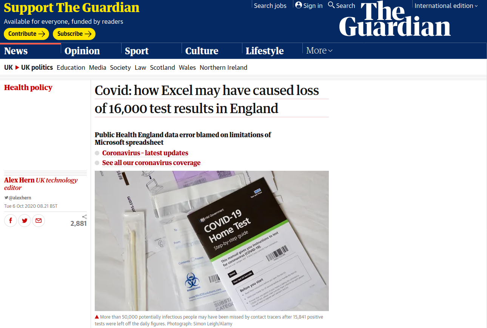
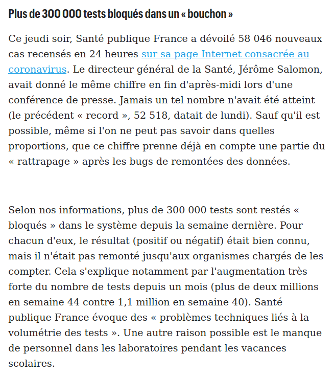
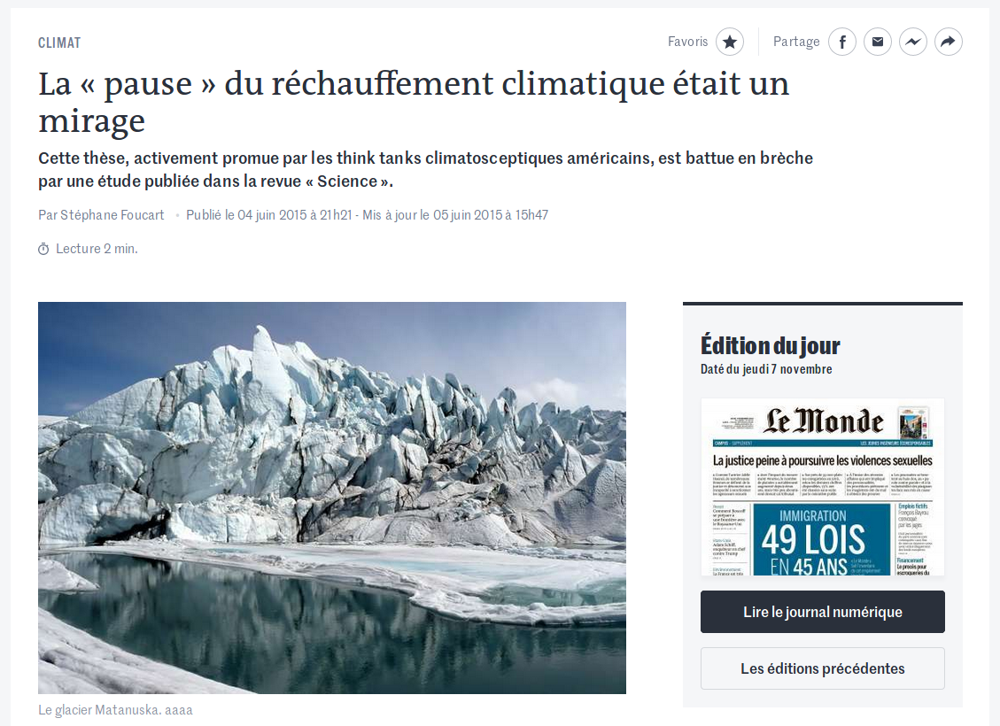
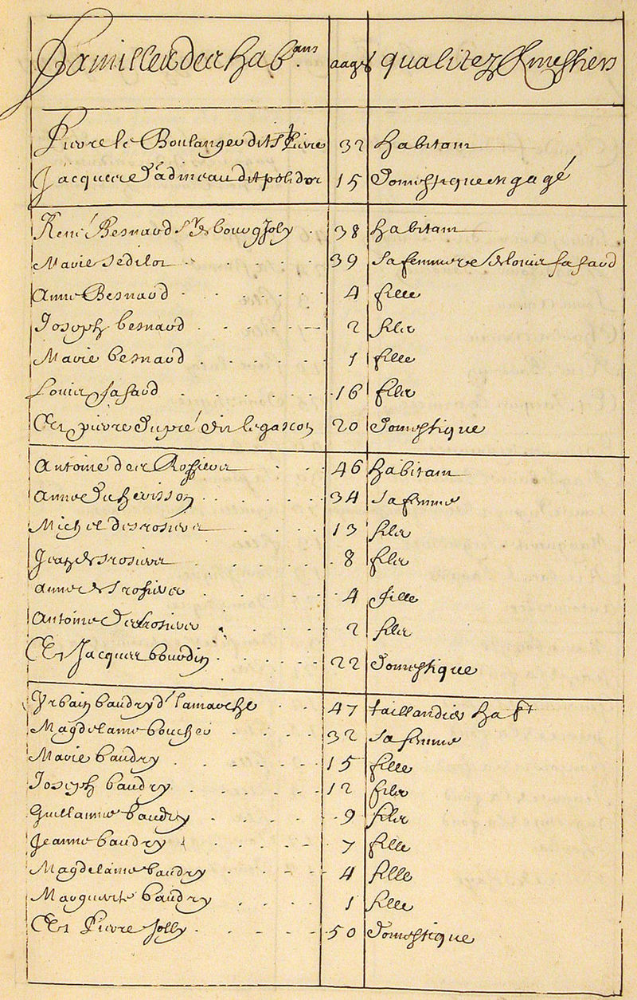
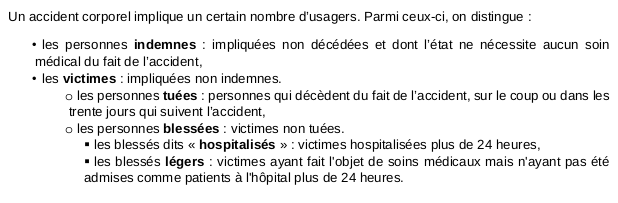
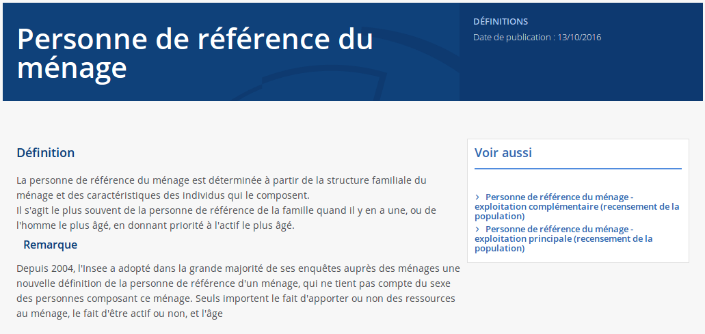

layout: true

`r paste0("
", params$event, " 

")` 

---

class: center, middle

Ces slides en ligne : `r paste0("http://sylvainlapoix.github.com/", params$slug, "/", params$session)`

Sources : `r paste0("https://github.com/sylvainlapoix/", params$slug)`

---

background-image: url("https://media.giphy.com/media/l0HlN5Y28D9MzzcRy/giphy.gif")
class: center, top, inverse

# I : des données qui changent tout

---

### Quand Excel a crashé le NHS (UK)

#### [Covid: how Excel may have caused loss of 16,000 test results in England](https://www.theguardian.com/politics/2020/oct/05/how-excel-may-have-caused-loss-of-16000-covid-tests-in-england), The Guardian, 06/10/2020

---

### Du bug informatique au bug sanitaire

La cause :

> *In this case, the Guardian understands, one lab had sent its daily test report to PHE in the form of a CSV file – the simplest possible database format, just a list of values separated by commas. That report was then loaded into Microsoft Excel, and the new tests at the bottom were added to the main database. But while CSV files can be any size, Microsoft Excel files can only be 1,048,576 rows long [...] **When a CSV file longer than that is opened, the bottom rows get cut off and are no longer displayed**. That means that, once the lab had performed more than a million tests, it was only a matter of time before its reports failed to be read by PHE.*

La conséquence :

> *The data error, which led to 15,841 positive tests being left off the official daily figures, means than 50,000 potentially infectious people may have been missed by contact tracers and not told to self-isolate.*

---

### Emoubteillages de test à l'ARS (France)

Le problème ne se cantonne pas au Royaume-Uni.

Le 6 novembre, l'ARS révélait qu'un *"embouteillage"* avait empêché de prendre en compte plusieurs centaines de milliers de tests Covid (voir [Le Parisien, 06/11/2020](https://www.leparisien.fr/societe/covid-19-des-indicateurs-de-tests-sous-evalues-a-cause-de-bugs-dans-la-remontee-des-donnees-06-11-2020-8406911.php), ci-dessous).

.pull-left[

]

.pull-right[Ces retards dans la remontée de résultat ont provoqué une mauvaise évaluation du taux de positivité.

Dans les deux cas, **des considérations techniques ont faussé l'évaluation d'un phénomène, entraînant des conséquences concrètes dans le débat public et la politique sanitaire**.]

---

### D'autres erreurs instrumentales historiques

[La « pause » du réchauffement climatique était un mirage](https://www.lemonde.fr/climat/article/2015/06/05/la-pause-du-rechauffement-climatique-etait-un-mirage_4647745_1652612.html), Le Monde, 04/05/2016.

---

background-image: url("https://media.giphy.com/media/JrGlLg0Ycz3XrufJ40/giphy.gif")
class: center, top, inverse

# II : définir et convenir

---
  
### [Quantifier, c'est convenir puis mesurer](http://www.pressesdesmines.com/media/extrait/PourSocioHistExtr.pdf)

.pull-left[
> Le verbe quantifier est employé ici dans un sens large : **exprimer et
faire exister sous une forme numérique ce qui, auparavant, était exprimé par
des mots et non par des nombres**.
]

.pull-right[

]

---

background-image: url(./img/numerusclausus.png)
class: center, top, inverse

# Pourquoi produit-on des données ?

---

## Un processus complexe

Une donnée n'est ni gratuite, ni immanente.

Produire de la donnée nécessite :
* des moyens
* des motivations
* une méthode.

Les données ne sont pas produites par hasard.

---

## La Bible : un best-seller plein de recensements

**Dans l'Ancien Testament**
* Le livre est Nombres comporte deux recensements ;
* David est puni pour avoir dénombré Israël et Juda ;

**Dans le Nouveau Testament**
* c'est à l'occasion du recensement de l'Empereur Auguste que Marie et Joseph quittent Nazareth pour se rendre à Bethléem.

--

Le contexte politique est incertain mais plusieurs auteurs romains attestent de ce projet :
Auguste souhaitait faire "un inventaire des ressources de son empire" : *"le nombre des citoyens et des alliés en armes, celui des flottes, des royaumes, des provinces"* (Tacite, Annales, 1,11)

---

### Lever les impôts et faire la guerre

.pull-left[
> *"combien et pourquoi"*, Vauban.

En 1676, Vauban ordonne le recensement de Valenciennes : le premier recensement *"tête par tête"* de l'histoire de France.

Son objectif : *"actifs économiques et démographiques"*.

Source : [Vauban, inventeur des recensements](https://www.persee.fr/doc/adh_0066-2062_1975_num_1975_1_1282), Vilquin, 1975.]

.pull-right[
Recensement de la Nouvelle-France par Jean Talon (1666).

]

---

### Combien ça coûte un recensement ?

Le budget du recensement est fixé par la loi. En l'occurrence, [le décret du 17 décembre 2015](https://www.legifrance.gouv.fr/affichTexte.do?cidTexte=JORFTEXT000031632586&categorieLien=id) :
* 1.72€ par personne et 1.13€ par logement en "métropole" ;
* 2.05€ par personne et 1.36€ par logement dans les départements d'Outre-Mer, Saint-Pierre-et-Miquelon, Saint-Barthélemy et Saint-Martin.

Ces dernières années, le coût a totalisé environ 20 millions d'euros par an ([Sénat, 2017](https://www.senat.fr/questions/base/2017/qSEQ171202311.html)).

Et ça prend du temps : quatre ans de collecte, compilation, traitement et publication des résultats.

---

## Capter le signal

La production de la donnée suppose une collecte.

Dans certains cas, la donnée est perceptible par les sens ou des instruments de mesures. Il s'agira alors de s'accorder sur les conventions (outils, notations et unités de mesure).

Si la donnée n'est pas directement perceptible, il sera nécessaire de trouver des indices ou des témoignages indirects.

Si la donnée est sociale, il faudra établir un protocole de collecte nécessitant de nombreux préalables (population, modalités de collecte, modalités de compilation ...).

Chacun de ces cas de figure nécessite de faire des choix qui influent directement sur la collecte et donc sur les données collectées.

---

### Que mesure un thermomètre ? (question piège)

---

background-image: url("https://media.giphy.com/media/BYv467aAFGHHG/giphy.gif")
class: center, top, inverse

## C'est ce qu'on appel un "proxy"

---

### La température corporelle

Comment est né le consensus suivant lequel les adultes humains ont une température corporelle en bonne santée de 37°C ?

--

.pull-left[
En 1868, un médecin allemand, **Karl Reinhold August Wunderlich** publie *Das Verhalten der Eigenwarme in Krankenheiten* dans lequel il pose à 37°C la *"température normale du corps adulte en bonne santé"*.

Sa méthodologie était la suivante :
* 25000 patient·e·s ;
* 1M de relevés de température ;
* différentes heures.

Il intègre deux variables complémentaires, le genre et la race (avec des réserves).
]

.pull-righ[
.center[

]

[Son étude a depuis été testée](https://jamanetwork.com/journals/jama/article-abstract/400116) et légèrement corrigée.

Source : [BBC, The mathematics of fever](https://www.bbc.co.uk/programmes/w3cswk3g).
]

---

### Les seuils sont partout

La [Base des accidents corporels de la circulation (Baac)](https://www.data.gouv.fr/en/datasets/bases-de-donnees-annuelles-des-accidents-corporels-de-la-circulation-routiere-annees-de-2005-a-2019/#_) recense la totalité des accidents impliquant un véhicule sur la voie public et ayant causé des blessures à au moins un individus.

Or, que signifie une *"personne blessée"* ou même une personne *"morte des suites de ses blessures"* ? La production de données appelle des définitions objectifs de ces phénomènes pour pouvoir comptabiliser de manière homogène des événements très variés. Et, pour cela, les autorités ont recours à des seuils.

--

---

### Le besoin de définition

Quelle est [la définition du chômage](https://www.insee.fr/fr/metadonnees/definition/c1129) ?

--

Définition (BIT, 1982) :
* un chômeur est une personne en âge de travailler (15 ans ou plus) qui répond simultanément à trois conditions :
* être sans emploi, c'est à dire ne pas avoir travaillé au moins une heure durant une semaine de référence ;
* être disponible pour prendre un emploi dans les 15 jours ;
* avoir cherché activement un emploi dans le mois précédent ou en avoir trouvé un qui commence dans moins de trois mois.

--

Comment peut-on le faire baisser sans modifier la définition ?

--

Tout le problème est dans la question : veut-on changer la société ou la valeur de l'indicateur ?

---

### Les définitions peuvent être vectrices de représentations

Exemple : le "chef de famille".

.footnote[Source : [Insee](https://www.insee.fr/fr/metadonnees/definition/c1192)]

---

background-image: url("https://media.giphy.com/media/TEoYy680hi3CT3nsRN/giphy.gif")
class: center, top, inverse

# III : la donnée, un sujet politique

---

class: inverse, center, middle

# Merci de votre attention.

## Si vous avez des questions.

Contact : [Sylvain Lapoix](mailto:sylvainlapoix@gmail.com)